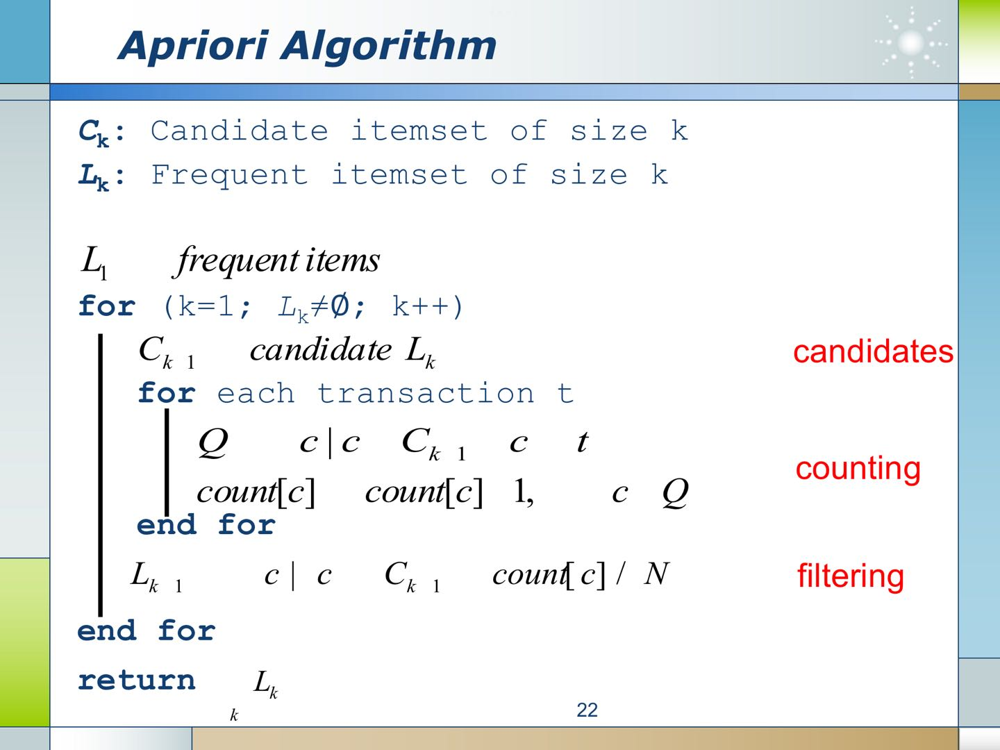
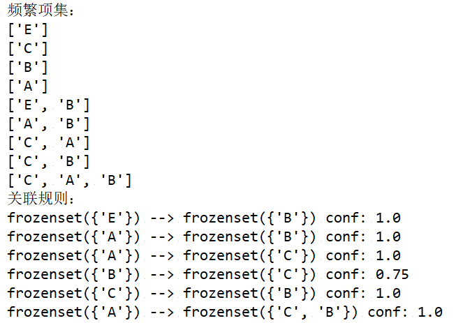

## 相关概念

### frequent Item - 频繁项集

项与项集： 设Itemset = {item_1，item_2，...item_n}是所有项的结集合

其中item_k(k=1,2,3,...n)被称为项，项的集合被称之为itemset

频繁项集：如果项集I的相对支持度满足实现定义好的最小支持度阈值，则I是频繁项集。

这个最小支持度阈值是自己给定的

### Support - 支持度

support of an association rule(关联规则的可信度)---本质上来讲就是频率：

<!-- more -->

其中表示包含X和Y的并集的概率
$$
Support(X \to Y) = \frac{(X \cup Y) }{n}
$$

### Confidence  - 置信度

$$
Confidence(X \to Y) = \frac{ (X \cup Y)}{X}
$$

从本质上来看，这个表达式与条件概率没有区别，就是计算一个先验概率
$$
Confidence(X \to Y) = \frac{Support(X \cup Y)}{Support(X)}
$$
条件概率公式：$ P(Y | X) $

强关联规则：满足最小支持度和最小置信度的关联规则

## Aprior算法

算法核心思路：

+ 一个频繁集中的所有想都必须是频繁项
+ 一个不频繁项的超集都是不频繁的

算法流程：

+ 找出所有的频繁项集
+ 由频繁集产生强关联规则

伪代码描述过程：



其中：Candidate为候选集，需要之前的$L_k$中挑出可靠的频繁集

python代码实现：

ps：在学习他人的代码的同时，也需要学习对应的代码书写规范，注释等。

```python

def loadDataSet():
    """
    function: 构造原始数据
    :return: 原始数据集合
    """

    return[['A', 'B', 'C'],
           ['B', 'C', 'E'],
           ['A', 'B', 'C', 'D'],
           ['B', 'E']]

def createC1(dataSet):
    '''
    function: 将所有元素装换为frozenset型字典，并存放到列表中
    :param dataSet:
    :return:
    '''
    C1 = []
    for transaction in dataSet:
        for item in transaction:
            if not [item] in C1:
                C1.append([item])
    C1.sort()
    # 此处使用frozenset是为了可以讲这些值作为字典的键
    # frozenset为不可变集合，set为可变集合
    return list(map(frozenset, C1))

def scanD(D, Ck, minSupport):
    """
    function：过滤掉不符合支持度的集合
    实现：
        遍历原始数据集合候选频繁项集，统计频繁项集汇中出现的次数
        由此计算出支持度，再对比支持度是否满足要求
        不满足的话则剔除，同时保留每个数据的支持度
    :param D: 原始数据转换后的字典
    :param Ck: 候选频繁项集
    :param minSupport: 最小支持度
    :return: 频繁项集列表retList 所有元素的支持度字典
    """
    ssCnt = {}
    for tid in D:
        for can in Ck:
            if can.issubset(tid):
                if can not in ssCnt:
                    ssCnt[can] = 1
                else:
                    ssCnt[can] += 1
    numItems = float(len(D))
    retList = []
    supportData = {}
    for key in ssCnt:
        support = ssCnt[key] / numItems
        if support >= minSupport:
            retList.insert(0, key)
        supportData[key] = support
    return retList, supportData  # 排除不符合支持度元素后的元素 每个元素支持度

def aprioriGen(Lk, k) :
    """
    功能： 生成所有可以组合的集合
    具体逻辑：通过每次比对频繁项集相邻的k-2个元素是否相等，如果相等就构造出一个新的集合
    :param Lk: 频繁项集列表Lk
    :param k: 项集元素个数k，当前组成项集的个数
    :return: 频繁项集列表Ck

    举例：[frozenset({2, 3}), frozenset({3, 5})] -> [frozenset({2, 3, 5})]
    """
    retList = []
    lenLk = len(Lk)
    for i in range(lenLk) :  # 两层循环比较Lk中的每个元素与其它元素
        for j in range(i + 1, lenLk) :
            L1 = list(Lk[i])[:k - 2]  # 将集合转为list后取值
            L2 = list(Lk[j])[:k - 2]
            L1.sort();
            L2.sort()  # 这里说明一下：该函数每次比较两个list的前k-2个元素，如果相同则求并集得到k个元素的集合
            if L1 == L2 :
                retList.append(Lk[i] | Lk[j])  # 求并集
    return retList  # 返回频繁项集列表Ck

def apriori(dataSet, minSupport=0.5) :
    """
    function：apriori算法实现
    :param dataSet: 原始数据集合
    :param minSupport: 最小支持度
    :return: 所有满足大于阈值的组合 集合支持度列表
    """
    D = list(map(set, dataSet))  # 转换列表记录为字典，为了方便统计数据项出现的次数
    C1 = createC1(dataSet)  # 将每个元素转会为frozenset字典    [frozenset({A}), frozenset({B}), frozenset({C}), frozenset({D}), frozenset({E})]
    # 初始候选频繁项集合
    L1, supportData = scanD(D, C1, minSupport)  # 过滤数据,去除不满足最小支持度的项
    # L1 频繁项集列表 supportData 每个项集对应的支持度
    L = [L1]
    k = 2
    while (len(L[k - 2]) > 0) :  # 若仍有满足支持度的集合则继续做关联分析
        Ck = aprioriGen(L[k - 2], k)  # Ck候选频繁项集
        Lk, supK = scanD(D, Ck, minSupport)  # Lk频繁项集
        supportData.update(supK)  # 更新字典（把新出现的集合:支持度加入到supportData中）
        L.append(Lk)
        k += 1  # 每次新组合的元素都只增加了一个，所以k也+1（k表示元素个数）
    return L, supportData

def calcConf(freqSet, H, supportData, brl, minConf=0.7) :
    """
    对规则进行评估 获得满足最小可信度的关联规则
    :param freqSet: 集合元素大于两个的频繁项集
    :param H:频繁项单个元素的集合列表
    :param supportData:频繁项对应的支持度
    :param brl:关联规则
    :param minConf:最小可信度
    """
    prunedH = []  # 创建一个新的列表去返回
    for conseq in H :
        conf = supportData[freqSet] / supportData[freqSet - conseq]  # 计算置信度
        if conf >= minConf :
            print(freqSet - conseq,'-->',conseq,'conf:',conf)
            brl.append((freqSet - conseq, conseq, conf))
            prunedH.append(conseq)
    return prunedH

def rulesFromConseq(freqSet, H, supportData, brl, minConf=0.7) :
    """
    功能：生成候选规则集合
    :param freqSet: 集合元素大于两个的频繁项集
    :param H:频繁项单个元素的集合列表
    :param supportData:频繁项对应的支持度
    :param brl:关联规则
    :param minConf:最小可信度
    :return:
    """
    m = len(H[0])
    if (len(freqSet) > (m + 1)) :  # 尝试进一步合并
        Hmp1 = aprioriGen(H, m + 1)  # 将单个集合元素两两合并
        Hmp1 = calcConf(freqSet, Hmp1, supportData, brl, minConf)
        if (len(Hmp1) > 1) :  # need at least two sets to merge
            rulesFromConseq(freqSet, Hmp1, supportData, brl, minConf)

def generateRules(L, supportData, minConf=0.7) :  # supportData 是一个字典
    """
    功能：获取关联规则的封装函数
    :param L:频繁项列表
    :param supportData:每个频繁项对应的支持度
    :param minConf:最小置信度
    :return:强关联规则
    """
    bigRuleList = []
    for i in range(1, len(L)) :  # 从为2个元素的集合开始
        for freqSet in L[i] :
            # 只包含单个元素的集合列表
            H1 = [frozenset([item]) for item in freqSet]  # frozenset({2, 3}) 转换为 [frozenset({2}), frozenset({3})]
            # 如果集合元素大于2个，则需要处理才能获得规则
            if (i > 1) :
                rulesFromConseq(freqSet, H1, supportData, bigRuleList, minConf)  # 集合元素 集合拆分后的列表 。。。
            else :
                calcConf(freqSet, H1, supportData, bigRuleList, minConf)
    return bigRuleList


if __name__ == "__main__":
    # 初始化数据
    dataSet = loadDataSet()
    # 计算出频繁项集合对应的支持度
    L, suppData = apriori(dataSet,minSupport=0.5)
    print("频繁项集：")
    for i in L:
        for j in i:
            print(list(j))
    # 得出强关联规则
    print("关联规则：")
    rules = generateRules(L, suppData, minConf=0.7)

```

运行效果：



[代码参考](https://blog.csdn.net/weixin_44106306/article/details/105978944)