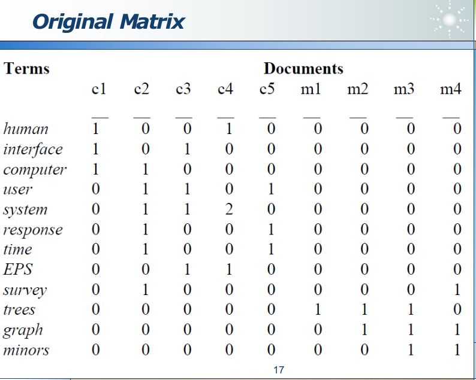
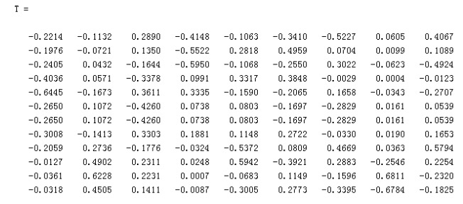
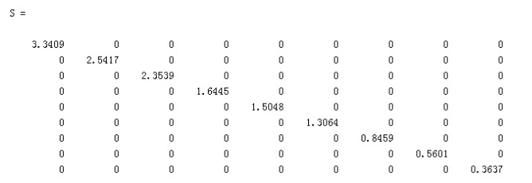
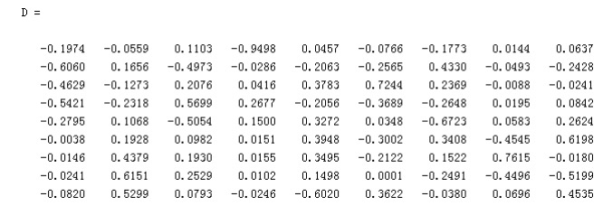
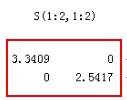
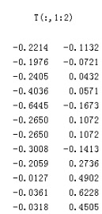
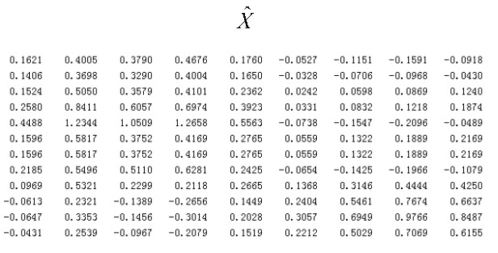
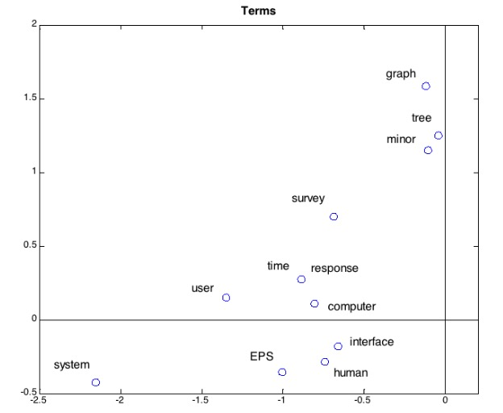
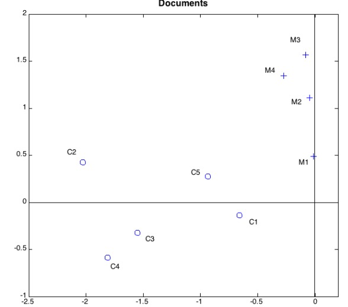

---

title: data-mining-推荐算法
mathjax: true
tags:
  - 推荐算法
categories:
  - 数据挖掘
  - 推荐算法
abbrlink: 4225
date: 2021-11-24 22:02:47
---

## TF-IDF

### tf

​		首先思考一个问题，搜索一个关键词的时候，我们一般很快想到这个词在这个文本中出现的次数，如果次数多的话那么我们可以认为这个文本对于这个关键字来说是匹配的

故提出了TF概念，其实本质上来说就是单词在文本中出现的频率

$$
tf(t,d) = \frac{n_{t,d}}{\sum_{k}n_{k,d}}
$$

### idf

​		再思考这么一个问题，仅仅考虑频率合理吗？例如一个文本中含有大量“我，的”这种词，而你的搜索词中正好也有这两个词的话，那么现在我们通常情况下都不会考虑这个频繁词，那么我们如何来实现这一件事情呢？于是人们提出了IDF的概念，用来抵消这一现象

<!--more-->
$$
idf(t,D) = log\frac{|D|}{| \{ d \in D:t\in d \}|}
$$
​		其中分子$|D|$指的是文档的个数，分母指的是包含关键字的文档的个数。举个例子来说，有两个文本，其中两个文本都有"的"，那么分子就是2，分母也是2，结果是1再取对数就是0。

### tf-idf

​		接下来就很简单了，该描述我们的TF-IDF了，所谓TF-IDF就是将TF和IDF进行一个相乘的运算，即
$$
tf-idf = tf × idf
$$
​		很明显从这个公式中我们可以知道，IDF它什么样的情况下会大呢，它希望这个关键词在我的文本出现的多并且在别的文档中出现的次数少，这样才会显得我的文本比别人的显得有特点。

### multiple query word

​		那么当出现了有多个查询呢，例如computer network，那么就对两个单词做拆分，分别计算每个单词的tf-idf，然后最后进行一个累加操作，非常简单
$$
score = \sum_{t\in q}tf-idf(t,d,D)
$$
### 需要思考的问题

​		现在可以计算tf-idf了，接下来我们需要干什么呢？答案是将文本输入到计算机中去！但是计算机是理解不了我们的文本的呀，所以说有一个聪明的人他简单粗暴的将文本中含有多少个词，就对应与一个向量vector，例如这个文本中有10000个单词的话，那就直接将这个单词映射为10000维的向量，对其中的每一个单词上进行编码的话就是让对应的向量某一位为1，其它位为0，这样就可以表示这1万个向量，但是这种表示方法（词袋模型）很快就会出现许多问题，例如：

+ 如果单词数量非常多的话，那么这个维数就会非常高，在计算过程当中，就会平增许多复杂的计算
+ 这种方法没有考虑单词与单词之间的关系，其实单词与单词之间是有关系，ont-hot编码方式直接认为各个单词之间是不相关的

​		还有一种表示方法，就是将一篇文档映射成一个向量，我认为这个是借鉴了one-hot的思想，它将一篇文档假设有1000个关键词，如果当这个关键词存在的话，则在对应的位置上改变数字，这个数字可以是1，也可以是出现的次数，也可以是对应关键字的tf-idf值，这些都是可行的，可表示为 $p=(w_{1,p},w_{2,p},...,w_{t,p})$

当可以将文档表示为vector的话，那么就可以计算两篇文章的相似度了，在这里我们使用余弦相似度来计算，余弦相似度和欧式距离在本质上是没有区别的，因为在计算方式（公式上）上可以等同为两个比较是等价的：
$$
sim(p,q) = cos(\theta)=\frac{p\cdot q}{|p|\cdot|q|}
$$
​		这样可以对文档进行聚类，但是实际来说是非常困难的，为什么呢？因为会出现许多的同义词，例如poor recall和poor precision这两个问题，poor recall指的是例如对应于我想搜索一个car但是有很多vehicle的文章并没有给我显示出来，poor precision例如搜索一个apple，对应水果和apple公司，你如何去做抉择，给你的搜索用户返回对应的页面呢？是各自50篇？都具有各自的问题，对于这一种现象的处理，后面有学者研究出了矩阵分解的相关方法来处理。

## Latent Semantic Analysis  隐含语义分析

​		首先直接给出公式
$$
X = TSD^T
$$
​		其中的X就是term-document矩阵，然后对X进行分解，咋一看非常像奇异值分解，关于奇异值分解我后续也会出一篇文章讲解一下（先画饼），其中T是一个正交阵，D也是一个正交阵，S是一个对角阵（类似于特征值矩阵），X：m×n ；T：m×r；S：r×r；D：n×r；其中r=rank(X)

那么现在我们来计算$XX^T$将会等于一个什么值，其中会有很巧妙的tips
$$
XX^T = (TSD^T)(TSD^T)^T = (TSD^TDS^TT^T)=T(SS^T)T^T
	= (TS)(TS)^T
$$
​		很奇怪我们为什么想要计算$XX^T$这一个东东呢？其实我们可以通过矩阵计算来解释一下，对于$XX^T$矩阵的第ij元素来说就是，第i个关键字与第j个关键字做了一个內积的和，这种的话我们从上面这个变换过程中可以看出，我们可以使用TS这一个矩阵替代掉原来的X矩阵，相当是使用了一个新的向量空间中的向量来替代对应的X矩阵，这个是对于term来说的，那如果我想对document也做一个类似这样的变化怎么搞？其实细心的人就会发现，只要将$XX^T$反过来即可也就是计算$X^TX$就能实现，现在还有一个问题，TS这个矩阵的维度和原来应该是一样的吗？

​		其实并非如此，它的转变形式有点类似于PCA的方法，可以举个例子来看看：

​		假设我们的term-documents矩阵（X矩阵）如下图所示：

​		然后使用matlab的一个内置函数直接对X进行分解的话，可以得到上面的T 、S、 D矩阵

​		如图所示：

​		然后我们尝试使用TS来替代X矩阵，但是在这里我们选择只采用S的二维数据，相当于PCA中的特征值分解

​		然后为了保持X的维度不变，我们取T矩阵的前两列

​		这样我们就可以使用TS来替代原来的X矩阵，我们简记它为$\hat X$

​		在我们得到这一个之后的话,我们就可以将它画出来，相当于是基于Terms的一个图，可以神奇的发现这些点在变换空间之后，就已经有较好的分类效果了。

​		同理，对于Document也可以这么做，使用DS来近似描述$X^T$

​		可以较好的看出在经过对应的维度变换之后，就已经有较好的聚类效果了

## PageRank传奇

如何对网页进行推荐呢？网页=文本+链接

如何计算一个网页的属性呢？答案是PageRank

有个比较好的问题，为什么在计算PageRank的值的时候只考虑指向我的网页，而不考虑我指向谁的网页呢？其实答案也很简单，因为我指向谁我自己可以捏造，我直接连个好几万个网页，那这样子做我是不是网页影响力就增大了呢？

简单举个例子：假设我有一个关系图如下所示：

那么计算相关的PageRank值为：
$$
PR(A) = \frac{PR(B)}{2} + \frac{PR(C)}{1}+\frac{PR(D)}{3}
$$
分母为它们的number of outbound links，其中可以抽象的写成：
$$
PR(P_i) = \sum_{p_j \in M(p_i)} \frac{PR(p_j;t)}{L(P_j)}
$$
从公式中我们可以很容易看出计算PageRank值是一个迭代的过程，计算出一个就可以计算下一个的值，现常用的公式为：
$$
PR(P_i;t+1) = \frac{1-d}{N} + d\sum_{P_j \in M(p_i)}\frac{PR(p_j;t)}{L(P_j)}
$$
其中$M(p_i)$指的是所有指向i的链接集合，t为t时刻，L为outbound link numbers，其中d是一个[0,1]的数值，也可以被称之为阻尼系数，从物理意义上来看，可以理解为用户随机看到这个网页的概率，相当于对PR值做了一个平滑，把非孤立节点的PR值转移给孤立节点一些（某种意义上可以说是为了处理一些孤立节点），d通常设为0.85

我们也可以把上面这个公式写成矩阵的形式：
$$
R(t+1) = dMR(t)+\frac{1-d}{N}l
$$

$$
R_i(t) = PR(p_i;t) \space\space\space PR(p_i;0) =\frac{1}{N} \space\space d=0.85
$$

$$
M_{ij}= \begin{cases} \frac{1}{L(p_j)},if\space j \space links \space to \space i \\0,\space otherwise \end{cases} l=ones(N,1)
$$

$$
R = dMR+\frac{1-d}{N}l,\space \space for\space t\rightarrow \infin
$$

t对应于某一时刻 ，而R则对应于PageRank向量，每一维对应于一个PageRank值，其中当t$\rightarrow \infin$的时候可以让R(t+1)=R(t)，故有
$$
R=(1-dM)^{-1}\frac{1-d}{N}l
$$

## 协同过滤

### 基本思想

如何想判断一个人到底喜不喜欢某一件东西的时候，我们可以通过几个和他关系较好的人对这个东西的评价，从而决定是否对这个人做推荐，需要一个打分矩阵（可能非常稀疏），用户-商品矩阵，基于这个矩阵来做的

### 协同过滤会出现的一些问题

+ Gray Sheep

  某些人品味非常独特

+ Shilling Attack

  水军刷好评和差评，数据本身有错误

+ Cold Start

  冷启动，该用户第一次进这个网站，没有买过任何东西，如何做出推荐？

## 基于记忆的（memory）

### 基于用户的 User

本质思想是想计算用户之间的相似度

首先我们需要一个打分矩阵，行对应于用户，列对于商品来说，本质上基于这个矩阵来做的

举个例子来说：

计算两者相似度（本质上来说就是两个用户之间的相关性）的计算公式如下：
$$ {\sqrt}
W_{u,v} = \frac{\sum_{i \in I (r_{u,i} - \bar r_u)(r_{v,i}-\bar {r_v})}}{\sqrt{\sum_{i \in I}(r_{u,i}-\bar r_u)^2}\sqrt{\sum_{i \in I}(r_{v,i}-\bar r_v)^2}}
$$

$$
P_{a,i} = \bar r_a + \frac{\sum_{u\in U}(r_{u,i}-\bar r_u) \cdot w_{a,u}}{\sum_{u\in U|w_{a,u}|}}
$$

$\bar r_a$指的是用户a对每个项目的平均分，这样做的原因是为了平衡每个人打分的标准不同。

### 基于物品的 Item

例如我比较蜘蛛侠，钢铁侠，蝙蝠侠之间的相关性，其实很简单，也就是将之前的那个打分矩阵做一个转置即可

## 基于模型的 Model