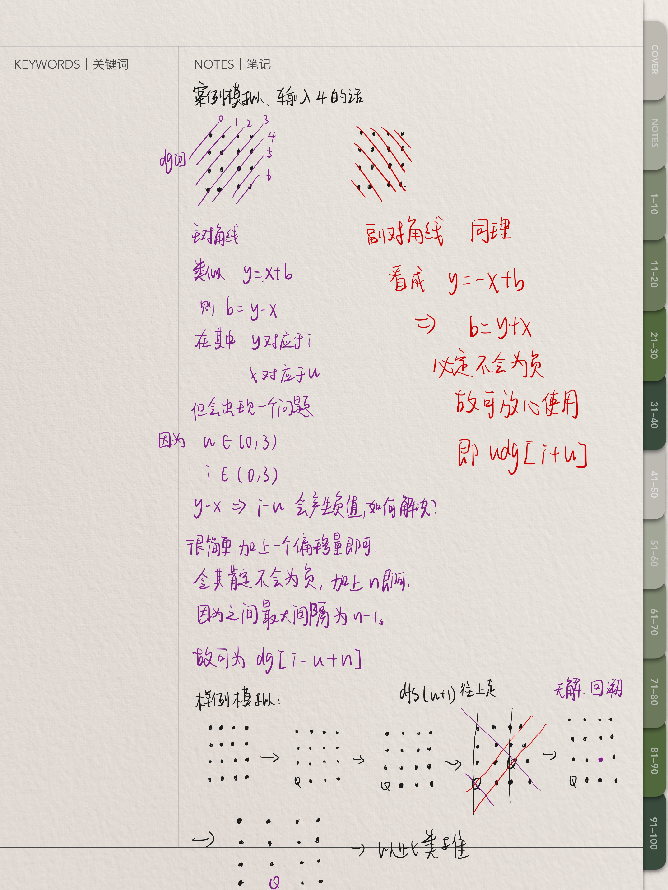

n−皇后问题是指将 n 个皇后放在 n×n 的国际象棋棋盘上，使得皇后不能相互攻击到，即任意两个皇后都不能处于同一行、同一列或同一斜线上。


现在给定整数 n，请你输出所有的满足条件的棋子摆法。

<!--more-->

#### 输入格式

共一行，包含整数 n。

#### 输出格式

每个解决方案占 n 行，每行输出一个长度为 n 的字符串，用来表示完整的棋盘状态。

其中 `.` 表示某一个位置的方格状态为空，`Q` 表示某一个位置的方格上摆着皇后。

每个方案输出完成后，输出一个空行。

**注意：行末不能有多余空格。**

输出方案的顺序任意，只要不重复且没有遗漏即可。

#### 数据范围

1≤n≤9

#### 输入样例：

```
4
```

#### 输出样例：

```
.Q..
...Q
Q...
..Q.

..Q.
Q...
...Q
.Q..
```

#### 算法流程描述

使用dfs暴力搜索



#### 代码

```c++
#include <iostream>

using namespace std;

const int N = 10*2;

int n;
//dg代表对角线 udg代表反对角线 col代表列
int col[N],dg[N],udg[N];
char g[N][N];  //用来保存原来的棋盘

void dfs(int u)  //u表示的是当前遍历的第u行元素
{
    if( u==n )  //说明遍历完成，输出存储的结果即可
    {
        for(int i=0;i<n;i++)
            //%s 输出的是一维数据
            printf("%s\n",g[i]); 
        printf("\n");
        return ;
    }
    //当u<n的时候
    for(int i=0;i<n;i++)
    {
        //分别对应于不同的对角线 u相当于x i相当于y 用截距
        if(col[i] == 0 && dg[i+u] == 0 && udg[n+i-u] == 0)
        {
            g[u][i] = 'Q';
            col[i] = dg[i+u] = udg[n-u+i] = 1;
            dfs(u + 1);
            //恢复现场
            col[i] = dg[u+i] = udg[n-u+i] = 0;
            g[u][i] = '.';
        }
    }
}

int main()
{
    cin >> n;
    for(int i=0;i<n;i++)
        for(int j=0;j<n;j++)
            g[i][j] = '.';
    
    dfs(0);  //从第0行开始
    return 0;
}
```


